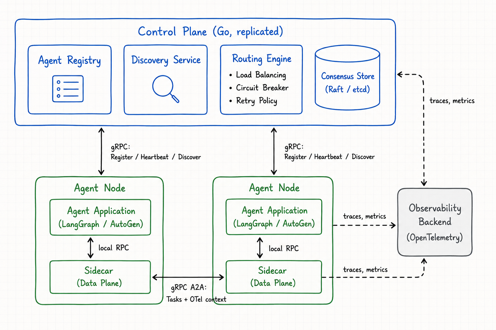

# AgentMesh — Design Document

**Status:** Draft (v0.1)
**Last updated:** 2026-05-31

---

## 1. Problem Statement

Multi-agent systems — software architectures in which multiple autonomous agents, typically powered by large language models, collaborate to accomplish tasks — have rapidly matured at the application layer. Frameworks such as LangChain, LangGraph, AutoGen, and CrewAI provide robust abstractions for reasoning, tool invocation, memory management, and inter-agent message passing within a single process or tightly coupled deployment.

This maturity, however, is confined to a narrow operational regime. When multi-agent systems transition from single-process prototypes to distributed production deployments — where agents are independently versioned, owned by separate teams, and scheduled across heterogeneous compute — they encounter two distinct and overlapping classes of failure, neither of which the current ecosystem addresses end-to-end.

### 1.1 Classical Distributed-Systems Failures

Multi-agent systems in distributed deployments inherit the well-studied failure modes of microservice architectures: ephemeral service instances and the resulting service churn, partial and asymmetric failures, cascading latency under load, the absence of structured service discovery, and the lack of health-aware request routing. These problems have established solutions in the form of service meshes such as Istio, Linkerd, and Consul Connect. However, multi-agent frameworks operate strictly at the application layer and do not natively integrate with this infrastructure, leaving each deployment to reinvent these primitives ad hoc.

### 1.2 Agent-Specific Failures

Beyond classical failures, multi-agent systems exhibit failure modes that are foreign to general-purpose service meshes:

- **Capability-based addressing.** A planner agent does not — and should not need to — know the network identity of a specific search agent. It must be able to dispatch a task to *any* agent advertising a `search` capability. Existing meshes route by service name, not by semantic capability.
- **LLM-specific failure semantics.** Rate limiting by upstream model providers, token-budget exhaustion, and long-running generations are first-order failure modes. A mesh that treats these as generic 5xx responses cannot reason about them correctly; for instance, retrying a rate-limited agent immediately deepens the failure rather than resolving it.
- **Asynchronous, stateful conversation flow.** Agent interactions are frequently multi-hop and stateful, with conversational context that must be preserved or propagated across hops. HTTP-oriented meshes have no native concept of such state.
- **Fragmented observability.** Trace context routinely breaks across asynchronous LLM call chains, rendering the resulting execution graphs opaque and difficult to debug post hoc.

### 1.3 Concrete Examples: Current Behavior vs. AgentMesh Behavior

To make the gap concrete, consider three representative scenarios drawn from production multi-agent deployments. Each illustrates a different class of failure from §1.2, and in each case the behavior of a system without AgentMesh is contrasted against the behavior the same system would exhibit with AgentMesh in place.

#### Scenario A: Rate-Limited Downstream Agent

A planner agent decomposes a user query into subtasks and dispatches them to a pool of research agents. One research agent enters a rate-limited state because its upstream LLM provider begins returning HTTP 429 responses for a fraction of requests.

**Without AgentMesh:**
1. The planner cannot distinguish a rate-limited agent from a healthy one. TCP and process-level health checks continue to pass; the agent is technically "up."
2. The planner continues routing to the failing instance using whatever static strategy is hardcoded in the framework — most commonly round-robin with no awareness of upstream backpressure.
3. Failed sub-queries are retried immediately and against the same agent, deepening the rate-limit window rather than relieving it.
4. The trace context linking the planner's invocation to the failed sub-call is propagated only as far as the synchronous boundary. When the call fails and is retried asynchronously, the linkage is lost.
5. The eventual postmortem must be reconstructed from log timestamps across multiple services, with no canonical execution graph.

**With AgentMesh:**
1. The data-plane sidecar attached to the research agent observes the 429 responses and exports them as a first-class signal (`agent.rate_limited`) to the control plane.
2. The routing engine marks the agent as degraded and removes it from the active pool for the `search` capability, with a configurable cooldown.
3. Subsequent planner requests are routed to other agents advertising the `search` capability. The planner code is unchanged; the mesh handles failover transparently.
4. Retries against the original agent are governed by a circuit-breaker policy with exponential backoff, preventing retry storms.
5. Trace context propagates across the asynchronous retry through OpenTelemetry baggage carried in gRPC metadata, producing a single, queryable execution graph.

#### Scenario B: A New Capability Comes Online

A separate team independently develops and deploys a new agent that advertises a `summarize` capability. The existing planner was not written with knowledge of this agent's existence and uses no hardcoded reference to it.

**Without AgentMesh:**
1. The planner has no mechanism to discover the new capability; it must be redeployed with explicit knowledge of the new agent's endpoint, or a hand-maintained lookup table must be updated and pushed.
2. Capability negotiation, if it exists at all, is implemented inside each orchestrator framework using non-portable conventions, duplicated across every team.
3. If the new agent is later scaled to multiple replicas, load distribution among those replicas becomes the orchestrator's responsibility, again reimplemented per framework.

**With AgentMesh:**
1. On startup, the new agent registers with the control plane, declaring its `summarize` capability along with metadata such as latency budget, concurrency limit, and version.
2. The planner queries the control plane (or receives a push update through a watch) for any agent matching the capability filter `summarize`. The planner code never references the new agent by name.
3. When the agent is scaled out, all replicas register independently. The routing engine distributes load across them using the configured strategy (round-robin, least-connections, etc.) with no planner-side changes.

#### Scenario C: Stateful Multi-Turn Conversation

A user engages in a multi-turn dialogue with a conversational system composed of specialized agents — for example, a triage agent that routes to either a billing or a technical-support agent. Each turn must reach an agent that has, or can reconstruct, the conversational state from prior turns.

**Without AgentMesh:**
1. Conversational state is either serialized in full on every request (expensive, and a privacy hazard when context contains sensitive material) or stored in an ad hoc sticky-session table consulted by the orchestrator before dispatch.
2. If the originally selected billing agent instance becomes unavailable mid-conversation, the orchestrator must implement bespoke failover logic to rehydrate state on a new instance or fail the conversation outright.
3. Trace context across turns is application-defined and frequently inconsistent across agents written by different teams.

**With AgentMesh:**
1. Conversational state is referenced by an opaque session handle propagated in gRPC metadata. The mesh routes requests bearing the same handle to a consistent agent instance where possible (session affinity).
2. If the affined instance becomes unavailable, the mesh transparently redirects to another instance advertising the same capability, optionally invoking a state-rehydration callback declared at registration time.
3. A single correlation ID, generated by the mesh at conversation start and propagated through every subsequent hop, anchors the execution graph for the entire dialogue, regardless of which agents participate.

#### Summary

These three scenarios are not exhaustive but they delineate the surface area AgentMesh addresses: resilience under partial degradation (Scenario A), discoverability of capabilities under deployment churn (Scenario B), and continuity of state and observability across asynchronous boundaries (Scenario C). Sections 2 and 3 formalize these behaviors as design goals and architectural components.

### 1.4 Existing Approaches and Their Limitations

Production teams today pursue one of two strategies, neither of which is sufficient:

- **Adopt a general-purpose service mesh** (Istio, Linkerd, Consul Connect). These provide mature solutions for classical distributed-systems failures but have no notion of capabilities, LLM-specific semantics, or conversational state. They mitigate the first class of failures while leaving the second untouched.
- **Hand-roll routing and resilience inside the orchestrator.** Agent frameworks can express capability-aware dispatch and LLM-aware retries at the application layer, but they cannot enforce these guarantees across heterogeneous deployments, lack consensus-backed registries, and rebuild distributed-systems primitives from scratch with each project.

### 1.5 What AgentMesh Is

AgentMesh is a control-plane and data-plane infrastructure layer — analogous in spirit to a traditional service mesh, but purpose-built for multi-agent systems running on Kubernetes — that natively understands capabilities, LLM-specific failure semantics, conversational state, and end-to-end agent observability. It sits between the agent framework above and the underlying transport (gRPC) below, providing the abstractions that frameworks assume but do not implement, and that general-purpose meshes implement but do not specialize for agents.

The project is delivered in two phases:

- **Phase 1 (v1) — Mesh primitives.** A capability-routed mesh on Kubernetes with tag-based discovery, a gRPC data plane, circuit-breaker resilience, and end-to-end OpenTelemetry observability. Control-plane state is backed by Kubernetes Custom Resource Definitions (CRDs). No security guarantees beyond the substrate's defaults.
- **Phase 2 (v2) — Security and governance.** A trust layer adding workload identity (SPIFFE-style or DID-based), mutually authenticated agent-to-agent communication (mTLS), and policy enforcement (OPA). Draws on patterns from prior art including the Agent Name Service paper (arXiv:2604.26997).

This document focuses on Phase 1. Phase 2 is referenced only where Phase 1 decisions must accommodate later additions.

---

## 2. Architecture Overview

The diagram above depicts the high-level architecture of AgentMesh: a Go **control plane** (Agent Registry, Discovery Service, Routing Engine, and a consensus-backed store) coordinating per-agent **sidecars** that form the data plane. Agent-to-control-plane traffic (registration, heartbeats, discovery) and agent-to-agent traffic (tasks with propagated OpenTelemetry context) both flow over gRPC. Traces and metrics from every component are exported to an OpenTelemetry backend, providing end-to-end observability across asynchronous multi-agent execution paths.

### 2.1 Substrate (Phase 1)

Phase 1 targets **Kubernetes as the sole substrate**. This shapes several elements of the architecture:

- The **control plane** is implemented as a Kubernetes controller — a Deployment running a reconciliation loop against the cluster's API server.
- The **Agent Registry** is realized as an `Agent` Custom Resource Definition (CRD). Agent records are first-class Kubernetes objects; the K8s API server (backed by its own etcd) provides storage, replication, watch semantics, and authorization. The "Consensus Store" shown in the diagram is, in Phase 1, the Kubernetes API server itself.
- **Sidecar injection** is performed by a mutating admission webhook so that any pod labeled as an AgentMesh-managed agent receives a sidecar automatically at pod creation.
- **Discovery and routing** are served by the control plane reading from its CRD-backed view; capability-set updates propagate to sidecars via watch streams or pull queries.

Choosing CRDs as the storage backbone removes the need to operate a separate consensus store, focuses learning on the Kubernetes operator pattern, and aligns the project naturally with its Phase 2 destination (secure agents on Kubernetes). Standalone etcd and embedded Raft were considered as alternatives and explicitly deferred; this decision can be revisited if Phase 2 requirements demand it.

Subsequent sections elaborate each component, its wire protocols, its state model, and its failure semantics.

---

## 3. Goals and Non-Goals

This section formalizes the scope of AgentMesh Phase 1 by stating, in commitment form, what the system *must* do, what it *must not* attempt, and what is deferred to subsequent phases. The goals below are the basis against which later design decisions and implementation milestones will be evaluated. Each goal and non-goal is assigned a stable identifier so that subsequent sections can refer back to specific commitments.

### 3.1 Goals

#### 3.1.1 Functional Goals

**G1. Capability-based agent registration.** Agents register themselves with the control plane on startup and advertise one or more capabilities (e.g., `search`, `summarize`). Registration produces a first-class Kubernetes object (`Agent` CRD) whose lifecycle is governed by standard Kubernetes mechanisms.

**G2. Capability-based discovery and routing.** A calling agent dispatches a request by capability rather than by network identity. The mesh resolves the request to a healthy agent advertising that capability and forwards the call. The caller's code never references peer agents by name or address.

**G3. Isolation of degraded agents.** When an agent enters a degraded state — defined as repeated failed responses within a configurable window — the mesh removes it from the active pool for affected capabilities and restores it after a cooldown. This behaviour is realized through a circuit-breaker pattern.

**G4. End-to-end trace propagation.** A single OpenTelemetry trace context spans the full multi-hop execution path across asynchronous agent-to-agent calls. The resulting execution graph is reconstructable from collected spans alone, without application-side correlation logic.

#### 3.1.2 Operational Goals

**G5. Kubernetes-native deployment.** AgentMesh runs entirely within a Kubernetes cluster. No operational components (other than the external OpenTelemetry backend) live outside the cluster.

**G6. Operability through `kubectl`.** All administrative operations — installing the mesh, inspecting agent state, viewing routing decisions — are available through standard Kubernetes tooling. AgentMesh does not introduce its own CLI in Phase 1.

**G7. Control-plane high availability.** The control plane runs with leader election and tolerates replica loss without interrupting registration, discovery, or routing of in-flight calls.

**G8. Local development viability.** The full system is deployable in a single-node Kubernetes cluster (e.g., `kind`, `minikube`) with no external dependencies beyond an OpenTelemetry collector. This constraint anchors the development loop.

#### 3.1.3 Reliability and Observability Goals

**G9. Fail-safe data plane.** If the control plane is unreachable, sidecars continue to serve in-flight requests using their last cached routing state. New discovery queries may fail closed, but established agent-to-agent traffic does not.

**G10. Debuggability from observability data alone.** A failure in a multi-agent call chain must be diagnosable from the exported traces and metrics, without recourse to application logs or per-agent debugging.

### 3.2 Non-Goals

#### 3.2.1 Deferred to Phase 2

The following are intentionally absent from Phase 1 but are anticipated in the Phase 2 security and governance layer:

**N1. Workload identity, authentication, and mutual authorization.** No SPIFFE, no DIDs, no mTLS between sidecars in Phase 1.

**N2. Policy enforcement.** No OPA, no policy language, no admission-time agent governance.

**N3. Cryptographic audit log of agent interactions.**

**N4. Multi-tenancy and namespace isolation guarantees beyond Kubernetes defaults.**

#### 3.2.2 Out of Scope (May Revisit, May Not)

The following are deliberately excluded; reintroduction would require fresh justification:

**N5. Semantic or embedding-based capability routing.** Phase 1 uses simple tag-based capability matching. Vector similarity, capability schemas, and typed-interface negotiation are not in scope.

**N6. Conversational state, session affinity, and stateful multi-turn continuity.** Each agent-to-agent call is treated as independent; preserving conversational state across hops is the application's responsibility in Phase 1.

**N7. Streaming gRPC.** Phase 1 supports unary request/response only.

**N8. Multi-cluster mesh federation.** A single Kubernetes cluster is the unit of deployment.

**N9. Non-Kubernetes substrates.** No VM, bare-metal, or serverless deployment targets in Phase 1.

**N10. Integration with existing service meshes (Istio, Linkerd, Consul).** AgentMesh is a standalone mesh in Phase 1, not a layer composed on top of an existing one.

#### 3.2.3 Pitfalls Explicitly Avoided

The following are not deferred features but *anti-design decisions* — paths the project commits to *not* taking, recorded here to prevent drift under implementation pressure:

**N11. The project will not reinvent Kubernetes primitives.** Deployments, Services, CRDs, RBAC, and admission webhooks are used as-is.

**N12. The project will not build a custom consensus store.** The Kubernetes API server (with its embedded etcd) is the sole durable state backend.

**N13. The project will not build a custom messaging substrate.** All control- and data-plane communication is gRPC.

**N14. The project will not build a graphical administrative interface.** `kubectl` and standard Kubernetes dashboards are the operational surface.

---

## 4. Phase 1 Scope

This section enumerates, in concrete bullet-pointed form, exactly what is built in Phase 1. Items reference the Goals (G*) and Non-Goals (N*) defined in §3 where applicable.

### 4.1 Components Built

**Control Plane (Go, runs inside the Kubernetes cluster):**
- Single Go binary, deployed as a Kubernetes Deployment with leader election
- **Agent Registry** — backed by `Agent` Custom Resource Definitions; reconciled into in-memory routing tables
- **Discovery Service** — gRPC endpoint serving capability → agent-set queries
- **Routing Engine** — target selection with round-robin load balancing and per-agent circuit-breaker state
- Reconciliation loop watching `Agent` CRD events (create / update / delete)
- Liveness / readiness probes, Prometheus metrics endpoint, OTel exporter

**Sidecar (Go, runs per agent pod):**
- Local gRPC server on loopback — agent application calls into the sidecar
- gRPC client to peer sidecars — handles outbound agent-to-agent (A2A) traffic
- Discovery client — pulls capability set from control plane; caches with TTL
- Routing client — requests target selection from control plane (or selects locally from cache)
- Circuit breaker — tracks per-peer failure rate; opens on threshold breach; half-open cooldown
- OpenTelemetry propagation — extracts and injects trace context in gRPC metadata
- Fail-safe mode — if control plane is unreachable, sidecar continues using last cached routing state (G9)

**Kubernetes Integration:**
- `Agent` CRD with schema, validation, and `status` subresource
- Mutating admission webhook — injects sidecar container into pods labeled `agentmesh.io/managed: "true"`
- ServiceAccount, ClusterRole, ClusterRoleBinding for the control plane
- Helm chart for installing the entire mesh (control plane + webhook + CRD + RBAC)
- Example workload manifests for sample agents

### 4.2 Wire Protocols

**gRPC: Sidecar ↔ Control Plane**
- `Register(agent_id, capabilities, metadata)` → lease handle
- `Heartbeat(agent_id, health, load)` → lease refresh
- `Discover(capability)` → set of candidate agents with metadata
- `SelectTarget(capability, policy)` → chosen agent

**gRPC: Sidecar ↔ Sidecar**
- `Invoke(capability, payload, metadata)` → response
- Metadata carries: OTel trace context, correlation ID, request deadline

**Kubernetes API:**
- Control plane reads / writes / watches `Agent` CRD objects via the K8s API server
- Webhook receives `AdmissionReview` requests for pod creation events

**OpenTelemetry:**
- OTLP/gRPC export from all components to an external collector

### 4.3 Behaviors and Features

- **Capability matching:** tag-based, string-set intersection; no embeddings, no schemas (N5)
- **Load balancing:** round-robin across healthy candidates
- **Circuit breaker:** configurable failure threshold, sliding window, half-open cooldown
- **Heartbeat health:** configurable interval; control plane evicts agent on lease TTL expiry
- **Trace propagation:** end-to-end via gRPC metadata; one trace per top-level request, spanning all hops (G4)
- **Fail-safe data plane:** sidecars continue routing using cached state if the control plane goes away (G9)

### 4.4 Tooling and Stack

- **Language:** Go (single language across control plane and sidecar)
- **Transport:** gRPC + Protocol Buffers
- **Kubernetes:** v1.28+ (for CRD v1 stability and pod admission features)
- **Controller framework:** `controller-runtime` (Kubebuilder-style scaffolding)
- **Observability:** OpenTelemetry Go SDK; OTLP/gRPC exporter; Jaeger or Tempo as the local trace backend
- **Local dev cluster:** `kind` (recommended) or `minikube`
- **Packaging:** Helm chart (preferred) with optional Kustomize overlays
- **Build:** Go modules, Dockerfile per binary, multi-arch images (`amd64`, `arm64`)

### 4.5 Milestones

The build is broken into incremental milestones; each is independently testable end-to-end.

- **M1 — Registry skeleton.** `Agent` CRD installed; control plane creates and reads CRDs; a stub agent registers itself by creating its own `Agent` object directly via the K8s API (no sidecar yet).
- **M2 — Sidecar registration.** Sidecar binary registers the agent via gRPC to the control plane; control plane materializes the `Agent` CRD; heartbeats refresh the lease.
- **M3 — Discovery and routing.** Sidecar resolves capabilities via the Discovery Service; round-robin selection across candidates; basic A2A gRPC call works end-to-end.
- **M4 — Circuit breaker.** Sidecar tracks per-peer failure rate; opens circuit on threshold; reseats after cooldown.
- **M5 — OTel propagation.** Trace context flows through gRPC metadata; a multi-hop A2A call produces a single, end-to-end trace in Jaeger / Tempo.
- **M6 — Sidecar injection.** Mutating webhook installed; labeled pods receive sidecars automatically at creation.
- **M7 — Local `kind` demo.** A single command (`make demo`) provisions a `kind` cluster, installs the mesh, deploys two sample agents, and executes a scripted scenario exercising G1–G10.

### 4.6 Definition of Done (Phase 1)

Phase 1 is complete when **all** of the following are true:

- A fresh `kind` cluster can be provisioned, AgentMesh installed via Helm, and the demo run end-to-end in under 10 minutes.
- At least two sample agents register with distinct capabilities and appear as `Agent` CRDs.
- A planner agent successfully invokes a capability by name (not by network identity) and the call routes to a healthy peer.
- Inducing repeated failures on one peer causes the circuit breaker to open and traffic to shift; restoring the peer reseats it after the cooldown window.
- A single OpenTelemetry trace, viewable in Jaeger or Tempo, spans the full planner → research → return path with all intermediate spans correlated.
- Killing the control plane mid-call does not abort in-flight requests (G9 verified).
- Every goal (G1 through G10) has at least one corresponding integration test.

### 4.7 Out of Phase 1 (Recap)

Restated for clarity; full justification in §3.2:

- mTLS, workload identity, policy, audit logging → Phase 2
- Semantic / embedding-based routing → N5
- Conversational state, session affinity, multi-turn continuity → N6
- Streaming gRPC → N7
- Multi-cluster federation, non-K8s substrates, mesh-on-mesh integration → N8–N10

---

*Sections 5 onward to be drafted.*
